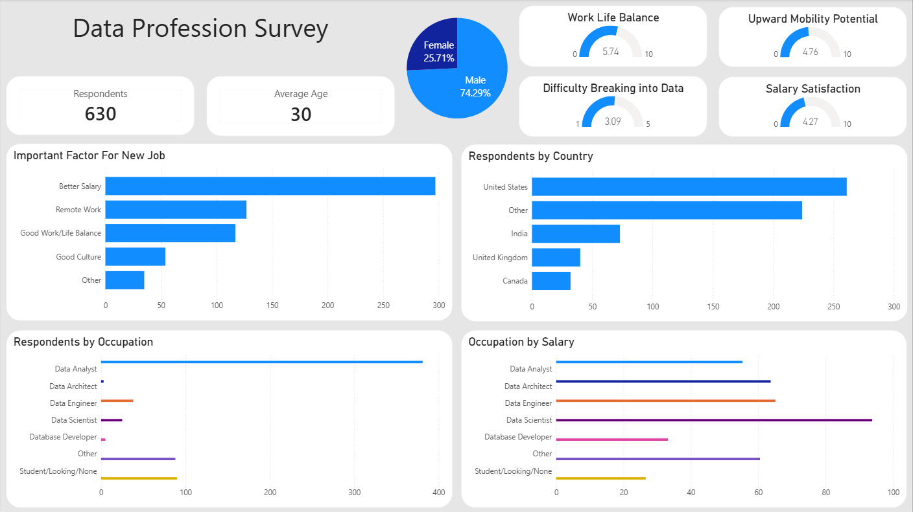

# Data-Profession-Survey-Dashboard

An interactive Power BI dashboard analyzing survey responses from data professionals, highlighting salary satisfaction, work-life balance, career progression, demographics, and employment trends.

---

## Overview

This project analyzes responses from a survey of data professionals using Power BI. The dashboard summarizes demographic information, career satisfaction, salary trends, and factors influencing employment decisions through interactive KPIs and visualizations.

---

## Technologies

- Power BI
- Power Query

---

## Project Workflow

Survey Dataset
      │
      ▼
Power Query
      │
      ▼
Data Cleaning
      │
      ▼
Power BI Dashboard

---

## Dashboard

---

## KPIs

- Respondents
- Average Age
- Work-Life Balance
- Upward Mobility Potential
- Salary Satisfaction
- Difficulty Breaking into Data

---

## Visualizations

- Important Factors for a New Job
- Respondents by Country
- Respondents by Occupation
- Occupation by Average Salary
- Gender Distribution

---

## Key Insights

- Better salary was the most important factor when considering a new job.
- The majority of survey respondents were located in the United States.
- Data Analysts represented the largest group of respondents.
- Data Scientists reported the highest average salaries among surveyed roles.
- Overall ratings for work-life balance and salary satisfaction were moderate.

---

## Repository Structure

Data-Profession-Survey-Dashboard/

├── powerbi/
│   └── Data Profession Survey.pbix
│
├── images/
│   └── dashboard.png
│
└── README.md

---

## Dataset

The dataset used in this project is publicly available through the Data Profession Survey conducted by Alex The Analyst.

https://github.com/AlexTheAnalyst/Power-BI/blob/main/Power%20BI%20-%20Final%20Project.xlsx
